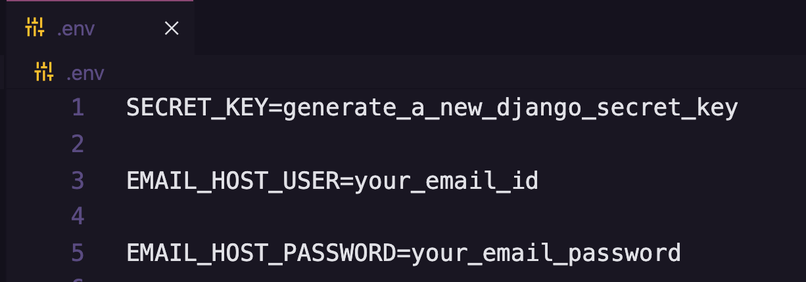

# Todo Application

This is a basic Todo Application (with Authentication) API using Django Rest Framework.

**Auth Section** - User can create an account an account (Signup), verify account (Verify), login into it (Login), change its password.

**Todo Section** - User can View his previously added todo items, create(add) new todo items, modify(edit) existing todo items and delete todo items.


## Author - Atharva Parkhe

- Github - [atharvparkhe](https://www.github.com/atharvparkhe/)
- LinkedIn - [Atharva Parkhe](https://www.linkedin.com/in/atharva-parkhe-3283b2202/)
- Instagram - [atharvparkhe](https://www.instagram.com/atharvparkhe/)
- Twitter - [atharvparkhe](https://www.twitter.com/atharvparkhe/)
## Features

- Create Account (Sign up)
- Verify your Account (Verification mail)
- Login into your account (Log in)
- Change Password (Forgot, Reset Password)
- Resend Verification/Password Reset email (Resend mail)
- View All Todos     -->  GET API
- Add new Todo item  -->  POST API
- Modify Todo item   -->  PATCH API
- Delete Todo item   -->  DELETE API


## Tech Used

Django, Django Rest Framework, Simple JWT using Python.


## Run Locally

***Step#1 :*** Create Virtual Environment

```bash
  virtualenv env
```

***Step#2 :*** Activate Virtual Environment

```bash
  source env/bin/activate
```

***Step#3 :*** Clone the project

```bash
  git clone https://github.com/atharvparkhe/todo.git
```

***Step#4 :*** Go to the project directory

```bash
  cd todo
```

***Step#5 :*** Install dependencies

```bash
  pip install -r requirements.txt
```

***Step#6 :*** Create a .env file 

Enter your Email ID and Email Password as shown in the sreeenshot.



***Step#5 :*** Import Endpoints

Import the endpoints.json file in Thunder-Client/Postman or any other API dev tool.

***Step#7 :*** Make Migrations

```bash
  python3 manage.py makemigrations
  python3 manage.py migrate
```

***Step#8 :*** Run Server

```bash
  python3 manage.py runserver
```

Check the terminal if any error.


## Demo

Youtube Tutorial - I will upload tutorial video soon. Stay Tuned.
## Documentation

The docs folder contain all the project documentations and screenshots related the project.